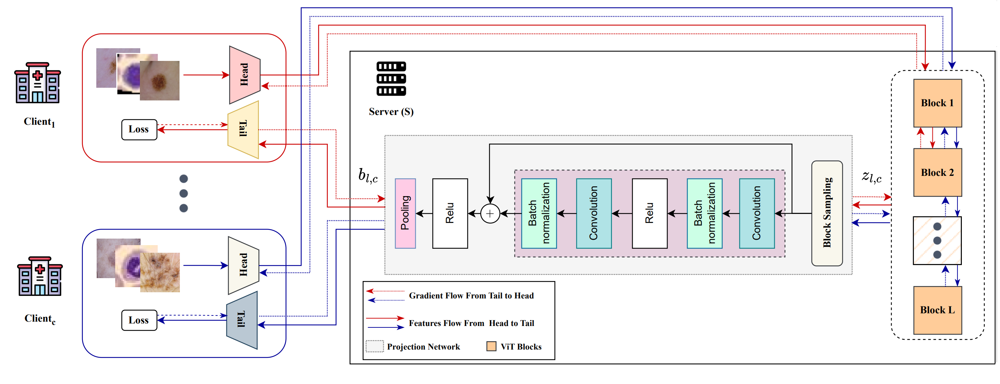

# FeSViBS
Source code for MICCAI 2023 paper entitled: 'FeSViBS: Federated Split Learning of Vision Transformer with Block Sampling'


<hr/>



## Abstract
Data scarcity is a significant obstacle hindering the learning of powerful machine learning models in critical healthcare applications. Data-sharing mechanisms among multiple entities (e.g., hospitals) can accelerate model training and yield more accurate predictions. Recently, approaches such as Federated Learning (FL) and Split Learning (SL) have facilitated collaboration without the need to exchange private data. In this work, we propose a framework for medical imaging classification tasks called Federated Split learning of Vision transformer with Block Sampling (FeSViBS). The FeSViBS framework builds upon the existing federated split vision transformer and introduces a \emph{block sampling} module, which leverages intermediate features extracted by the Vision Transformer (ViT) at the server. This is achieved by sampling features (patch tokens) from an intermediate transformer block and distilling their information content into a pseudo class token before passing them back to the client. These pseudo class tokens serve as an effective feature augmentation strategy and enhances the generalizability of the learned model. We demonstrate the utility of our proposed method compared to other SL and FL approaches on three publicly available medical imaging datasets: HAM1000, BloodMNIST, and Fed-ISIC2019, under both IID and non-IID settings.

## Install Dependinces
Install all dependincies by running the following command: 

```
pip install -r requirements.txt

```

## Datasets

We conduct all experiments on **three** datasets: 

1. HAM10000 [3] -- Can be downloaded from [here](https://www.kaggle.com/datasets/kmader/skin-cancer-mnist-ham10000?select=HAM10000_images_part_2)
2. Blood cells (BloodMNIST) -- MedMnist library [1]
3. Federated version of ISIC2019 dataset -- FLamby library [2]

For the Federated ISIC2019 dataset, the path to __ISIC_2019_Training_Input_preprocessed__ directory and __train_test_split__  csv file, are required to run different methods on this dataset

## Running Centralized Training/Testing
In order to run  **Centralized Training** run the following command: 

```
python centralized.py  --dataset_name [choose the dataset name] --opt_name [default is Adam] --lr [learning rate] --seed [seed number] --base_dir [path data folder for HAM] --save_every_epochs [Save pickle files] --root_dir [Path to ISIC_2019_Training_Input_preprocessed for ISIC2019]  --csv_file_path [Path to train_test_split csv for ISIC2019] --Epochs [Number of Epochs]

```


## Running Local Training/Testing for Each Client
In order to run  **Local Training/Testing** run the following command: 

```
python local.py  --local_arg True --dataset_name [choose the dataset name] --opt_name [default is Adam] --lr [learning rate] --seed [seed number] --base_dir [path data folder for HAM] --save_every_epochs [Save pickle files] --root_dir [Path to ISIC_2019_Training_Input_preprocessed for ISIC2019]  --csv_file_path [Path to train_test_split csv for ISIC2019] --num_clients [Number of clients] --Epochs [Number of Epochs]

```

## Running Vanilla Split Learning with Vision Transformers (SLViT)
In order to run  **SLViT without** Differential Privacy (DP) run the following command: 

```
python SLViT.py --dataset_name [choose the dataset name] --opt_name [default is Adam] --lr [learning rate] --seed [seed number] --base_dir [path data folder for HAM] --save_every_epochs [Save pickle files] --root_dir [Path to ISIC_2019_Training_Input_preprocessed for ISIC2019]  --csv_file_path [Path to train_test_split csv for ISIC2019] --num_clients [Number of clients] --Epochs [Number of Epochs]

```

**SLViT with** Differential Privacy (DP) run the following command:

```
python SLViT.py --DP True --epsilon [epsilon value] --delta [delta value] --dataset_name [choose the dataset name] --opt_name [default is Adam] --lr [learning rate] --seed [seed number] --base_dir [path data folder for HAM] --save_every_epochs [Save pickle files] --root_dir [Path to ISIC_2019_Training_Input_preprocessed for ISIC2019] --csv_file_path [Path to train_test_split csv for ISIC2019] --num_clients [Number of clients] --Epochs [Number of Epochs] 

```

## Running Split Vision Transformer with Block Sampling (SViBS):
In order to run  **SViBS** run the following command: 

```
python FeSViBS.py --dataset_name [choose the dataset name] --opt_name [default is Adam] --lr [learning rate] --seed [seed number] --base_dir [path data folder for HAM] --save_every_epochs [Save pickle files] --root_dir [Path to ISIC_2019_Training_Input_preprocessed for ISIC2019]  --csv_file_path [Path to train_test_split csv for ISIC2019] --num_clients [Number of clients] --Epochs [Number of Epochs] --initial_block 1 --final_block 6 

```

## Running Federated Split Vision Transformer with Block Sampling (FeSViBS):
In order to run  **FeSViBS without** Differential Privacy (DP) run the following command: 

```
python FeSViBS.py --fesvibs_arg True --local_round [number of local rounds before federation] --dataset_name [choose the dataset name] --opt_name [default is Adam] --lr [learning rate] --seed [seed number] --base_dir [path data folder for HAM] --save_every_epochs [Save pickle files] --root_dir [Path to ISIC_2019_Training_Input_preprocessed for ISIC2019]  --csv_file_path [Path to train_test_split csv for ISIC2019] --num_clients [Number of clients] --Epochs [Number of Epochs] --initial_block 1 --final_block 6 

```

In order to run  **FeSViBS with** Differential Privacy (DP) run the following command: 

```
python FeSViBS.py --fesvibs_arg True --DP True --epsilon [epsilon value] --delta [delta value] --local_round [number of local rounds before federation] --dataset_name [choose the dataset name] --opt_name [default is Adam] --lr [learning rate] --seed [seed number] --base_dir [path data folder for HAM] --save_every_epochs [Save pickle files] --root_dir [Path to ISIC_2019_Training_Input_preprocessed for ISIC2019]  --csv_file_path [Path to train_test_split csv for ISIC2019] --num_clients [Number of clients] --Epochs [Number of Epochs] --initial_block 1 --final_block 6 

```
## Citation
```
@misc{almalik2023fesvibs,
      title={FeSViBS: Federated Split Learning of Vision Transformer with Block Sampling}, 
      author={Faris Almalik and Naif Alkhunaizi and Ibrahim Almakky and Karthik Nandakumar},
      year={2023},
      eprint={2306.14638},
      archivePrefix={arXiv},
      primaryClass={cs.CV}
}

```
## References 

[1] Yang, J., Shi, R., Ni, B.: Medmnist classification decathlon: A lightweight automl benchmark for medical image analysis. In: IEEE 18th International Symposium on Biomedical Imaging (ISBI). pp. 191–195 (2021) 

[2] du Terrail, J.O., Ayed, S.S., Cyffers, E., Grimberg, F., He, C., Loeb, R., Mangold, P., Marchand, T., Marfoq, O., Mushtaq, E., Muzellec, B., Philippenko, C., Silva, S., Teleńczuk, M., Albarqouni, S., Avestimehr, S., Bellet, A., Dieuleveut, A., Jaggi, M., Karimireddy, S.P., Lorenzi, M., Neglia, G., Tommasi, M., Andreux, M.: FLamby: Datasets and benchmarks for cross-silo federated learning in realistic healthcare settings. In: Thirty-sixth Conference on Neural Information Processing Systems Datasets and Benchmarks Track (2022)

[3] Tschandl, P., Rosendahl, C., Kittler, H.: The ham10000 dataset, a large collection of multi-source dermatoscopic images of common pigmented skin lesions. Scientific Data 5(11), 180161 (Aug 2018).
